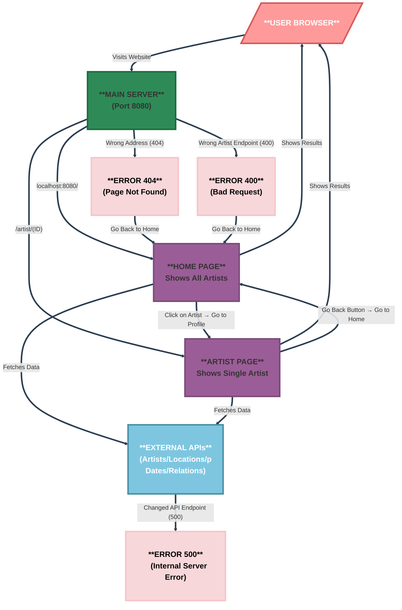

```mermaid
flowchart TD
    %% Increase arrow visibility
    linkStyle default fill:none,stroke:#2C3E50,stroke-width:4px

    %% Main components with large bold text
    USER[/"**USER BROWSER**"/]
    MAIN["**MAIN SERVER**
    (Port 8080)"]
    HOME["**HOME PAGE**
    Shows All Artists"]
    ARTIST["**ARTIST PAGE**
    Shows Single Artist"]
    API["**EXTERNAL APIs**
    (Artists/Locations/p
    Dates/Relations)"]
    ERROR404["**ERROR 404**
    (Page Not Found)"]
    ERROR400["**ERROR 400**
    (Bad Request)"]
    ERROR500["**ERROR 500**
    (Internal Server Error)"]

    %% Simple connections with bold arrows
    USER -->|"Visits Website"| MAIN
    MAIN -->|"localhost:8080/ "| HOME
    MAIN -->|"/artist/(ID)"| ARTIST
    HOME -->|"Fetches Data"| API
    ARTIST -->|"Fetches Data"| API
    HOME -->|"Shows Results"| USER
    ARTIST -->|"Shows Results"| USER
    HOME -->|"Click on Artist → Go to Profile"| ARTIST
    ARTIST -->|"Go Back Button → Go to Home"| HOME

    %% Error conditions
    MAIN -->|"Wrong Address (404)"| ERROR404
    MAIN -->|"Wrong Artist Endpoint (400)"| ERROR400
    API -->|"Changed API Endpoint (500)"| ERROR500

    %% Adding ability to go back to HOME on error 400 and 404
    ERROR404 -->|"Go Back to Home"| HOME
    ERROR400 -->|"Go Back to Home"| HOME

    %% Enhanced style definitions with dark green for MAIN SERVER
    classDef default font-size:20px,padding:20px,margin:20px,font-weight:bold;
    classDef box fill:#F7F7F7,stroke:#B0B0B0,stroke-width:4px,color:black;
    classDef user fill:#FF9A9A,stroke:#D85A5A,stroke-width:4px,color:white;
    classDef main fill:#2E8B57,stroke:#1C6D3F,stroke-width:4px,color:white; %% Dark green for MAIN SERVER
    classDef pages fill:#9B5D97,stroke:#7A4D7A,stroke-width:4px,color:white; %% Purple for HOME PAGE
    classDef api fill:#7EC6E0,stroke:#4A90A4,stroke-width:4px,color:white;
    classDef error fill:#F8D7DA,stroke:#F5C6CB,stroke-width:4px,color:black;

    %% Apply enhanced styles
    class USER user;
    class MAIN main;
    class HOME,ARTIST pages;
    class API api;
    class ERROR404,ERROR400,ERROR500 error;


```
